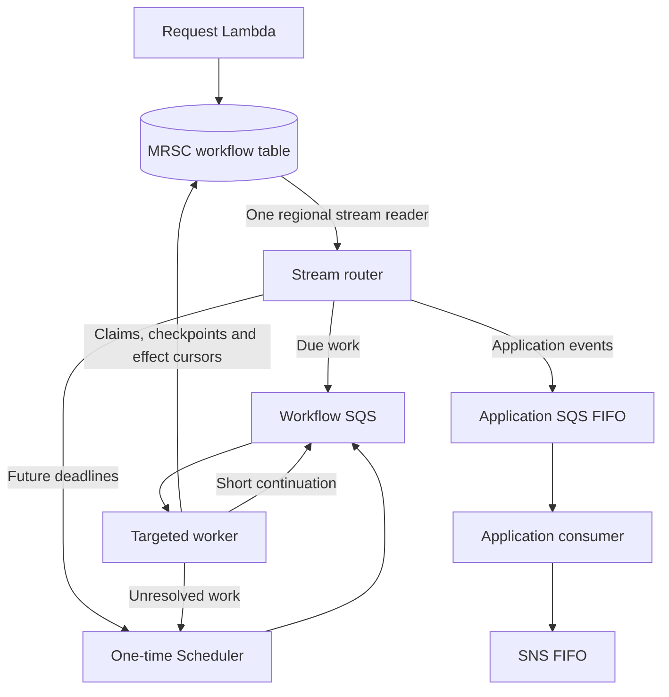

# tanstack-workflow-aws

An experimental AWS execution store and deployment adapter for the packaged **TanStack Workflow** engine. It supports active/active execution in `us-east-1` and `us-west-2` using a DynamoDB MRSC Global Table with a witness in `us-east-2`.

The package is ready for controlled integration testing. DynamoDB Local tests cannot establish regional quorum behavior, AWS delivery timing, or production capacity. See [testing](docs/testing.md).

## Architecture

Deploy the following pipeline independently in each application Region. Each replica has exactly one stream mapping. The router only performs durable fan-out; business handlers run behind a separate queue.



The targeted worker handles run recovery, timer delivery, recurring schedule buckets, committed publication intents, and retention. It strongly reads the named item, performs a conditional claim, and persists an unresolved item's successor before acknowledging the queue message. Normal execution does not discover unrelated due work. `DueIndex` supports explicit administrative store/runtime queries; it is not part of the worker's execution path. Cleanup uses bounded queries within a single run partition.

MRSC conditional writes coordinate execution across regions. A lost quorum stops writes. Queue delivery, stream delivery and external effects remain at least once: downstream handlers must use idempotency keys. Lambda@Edge distributes HTTP traffic but does not provide automatic POST failover.

## Package entry points

| Entry point | Purpose |
| --- | --- |
| package root | DynamoDB store, limits, storage version |
| `/workflow`, `/runtime` | Matching TanStack engine and targeted execution API |
| `/wakeups` | Injectable stream router, targeted worker and application queue factories |
| `/aws` | SQS and EventBridge Scheduler transport adapters |
| `/workflow-effects` | Committed application-event publication and continue-as-new helpers |
| `/schedules` | Future schedule calculation and missed-tick policy |
| `/events` | Generic application event publisher |
| `/ordered-events` | Ordered event log, cross-Region subscriber cursors and effect resolution |
| `/bridges/eventbridge`, `/bridges/sns`, `/bridges/sqs`, `/bridges/webhook` | Downstream destination adapters |

Use the matching engine exports; the store and runtime have a shared versioned storage contract. `/aws` requires the optional Scheduler and SQS SDK peers. See [installation and artifacts](docs/packaging.md).

```ts
import { randomUUID } from 'node:crypto'
import { createDynamoWorkflowExecutionStore } from '@ataylorme/tanstack-workflow-aws'
import { defineWorkflowRuntime } from '@ataylorme/tanstack-workflow-aws/runtime'

const store = createDynamoWorkflowExecutionStore({ tableName: process.env.TABLE_NAME! })
const runtime = defineWorkflowRuntime({ store, workflows: {
  task: { load: async () => (await import('./task.js')).workflow },
} })
const owner = `${process.env.AWS_REGION}:${randomUUID()}`
await store.withLeaseOwner(owner, () => runtime.startRun({
  workflowId: 'task', runId: 'stable-request-id', input: {},
  leaseOwner: owner, maxDurationMs: 5_000,
}))
```

Bind the same owner through `withLeaseOwner` for every runtime start, signal, approval, or targeted call. Use stable request/signal IDs across retries, including retries against the other region.

## Durable workflow effects

```ts
import { createWorkflow } from '@ataylorme/tanstack-workflow-aws/workflow'
import { publishWorkflowEvent, continueAsNew } from '@ataylorme/tanstack-workflow-aws/workflow-effects'

export const workflow = createWorkflow({ id: 'batch' }).handler(async ctx => {
  const input = ctx.input as { cursor: number; total: number }
  const next = await ctx.step('process-batch', step =>
    processBatch(input.cursor, { idempotencyKey: step.id }))
  await publishWorkflowEvent(ctx, 'batch-completed', {
    type: 'batch.completed', data: { cursor: next },
  })
  if (next < input.total) return continueAsNew(ctx, { cursor: next, total: input.total })
  return { complete: true }
})
```

`publishWorkflowEvent` commits an intent as a step checkpoint. Only reachable committed log records are published; staged segments are never delivered. A stable event ID makes publication retryable after an acknowledged write whose response was lost. `continueAsNew` must be returned from the handler: the committed terminal event creates one deterministic successor with fresh history. These helpers do not make external business transactions atomic. DSQL applications must use their own transactional outbox for DSQL-originated changes.

## Ordered subscribers

For a task lifecycle, publish `ordering: { streamId, sequence }` with requested, approved, started and completed at positions 1–4. The task example persists and enforces this type order. The ordered log commits only contiguous positions. Consumers using `createDynamoOrderedSubscriber` share one cursor and exclusive effect claim across Regions, so reordered or duplicate notifications cannot make them observe a later event first.

A subscriber timeout or uncertain external effect stops that stream until explicitly resolved. Claims never expire automatically. Handlers must await their effects; raw SNS/SQS consumers do not have the shared ordering guarantee. Ordered source logs and subscriber cursors remain retained. See [ordered events](docs/ordered-events.md) for the contract, deployment and recovery procedure.

## Schedules and lifecycle

Register cron/interval definitions once using `materializeWorkflowSchedules`. Workers atomically advance the next tick after consuming a bucket. Policies `skip`, `run-once` and bounded `catch-up` determine behavior after missed ticks; `allow` and `skip` control overlap. Generation-qualified bucket IDs isolate definition edits. See [scheduling and retention](docs/lifecycle.md).

Default per-run limits are 256 history events, 1 MiB serialized history, 300 KiB serialized items, and 1,000 accepted signal/approval IDs. Continue as new before reaching a limit. Terminal histories and unordered application payloads are retained for seven days, followed by compact tombstones for thirty days. Cleanup never removes a run with undelivered effects. Retention is explicit because MRSC has no TTL. Large payloads should be stored externally and referenced by immutable IDs.

## Deploy and test

1. Deploy `cloudformation/global-table.yaml` once and wait for both replicas to become active.
2. Build the Lambda handlers and deploy `cloudformation/workers.yaml` in each application Region with its local stream ARN.
3. Deploy `cloudformation/regional.yaml` for the optional standalone HTTP API, then `cloudformation/edge.yaml` for its routing layer. Add application authentication before exposing the API.
4. Deploy `cloudformation/ordered-subscriber.yaml` per logical ordered subscriber in each Region, using the same subscriber ID across Regions.
5. Seed schedule definitions from a deployment/configuration task.

Follow [deployment and operations](docs/workflow-wakeups.md), [TanStack Start integration](docs/tanstack-start-lambda-web-adapter.md), and [application events](docs/application-events.md).

```sh
npm ci
npm run typecheck
npm run build
DYNAMODB_LOCAL_JAR=/path/to/DynamoDBLocal.jar npm run test:integration
npm run test:package
cfn-lint cloudformation/*.yaml
```

The optional templates provision billable AWS resources. No deployment is performed by installation or by the local test commands.
