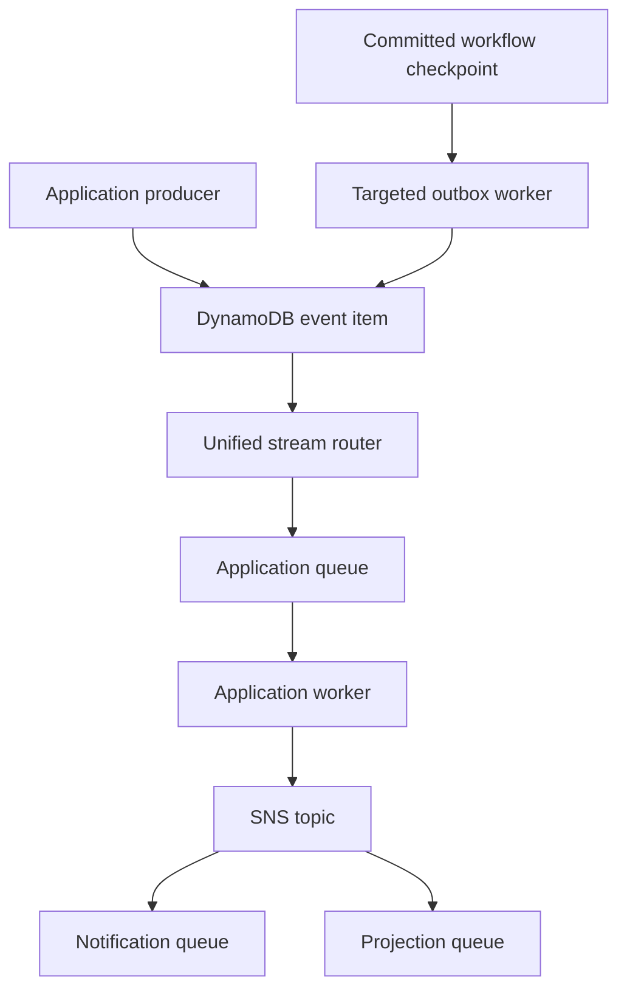

# Application events and committed workflow effects

The unified DynamoDB Stream router durably fans out immutable application facts to the application queue. Its private application worker publishes to the regional SNS topic. Independent consumers subscribe through their own queues and deduplicate by event ID. Workflow execution and application delivery have separate concurrency, retry and dead-letter queues. Deploy exactly one router mapping per replica; downstream consumers do not attach to that stream.



## Publish

```ts
import { createDynamoApplicationEventPublisher } from '@ataylorme/tanstack-workflow-aws/events'
const events = createDynamoApplicationEventPublisher({ tableName: process.env.TABLE_NAME! })
await events.publish({ id: 'task-123:requested', type: 'task.requested',
  data: { taskId: 'task-123', requestedBy: 'user-456' } })
```

Supply a stable ID for retries. An omitted ID generates a UUID. The publisher conditionally creates `EVENT#<id>/META`. On duplicates or ambiguous write responses, it strongly reads that item: identical content returns the original envelope; different content throws `ApplicationEventConflictError`. An omitted timestamp preserves the original timestamp during reconciliation. An explicitly supplied timestamp must match. Writers need both `PutItem` and `GetItem`.

The envelope contains `id`, `type`, positive integer `version` (default 1), ISO `timestamp`, JSON `data`, and optional `correlationId`, `causationId` and string-valued `metadata`. IDs are bounded to 256 characters, types to 100, nesting to 24, and serialized envelopes to 240 KiB. Convert dates and other non-JSON values deliberately; store large payloads externally. Validation rejects undefined, bigint, unsafe/nonfinite numbers, cycles and class instances before writing.

Inside a workflow, use the committed-log helper:

```ts
import { publishWorkflowEvent } from '@ataylorme/tanstack-workflow-aws/workflow-effects'
await publishWorkflowEvent(ctx, 'task-requested', {
  type: 'task.requested', data: { taskId: ctx.input.taskId },
})
```

The helper checkpoints an intent with a deterministic step-derived ID. The log head and pending outbox boundary commit atomically on the run item. The targeted worker publishes only committed intents and acknowledges its cursor after durable publication. A failed or ambiguous acknowledgement safely retries the same ID. Staged, unreachable log segments never publish. An event describes its checkpoint, not successful completion of subsequent steps.

Application database mutations and direct publication are separate operations. Producers needing atomic state-to-event handoff must implement an outbox in their authoritative database. The workflow helper provides that handoff for workflow checkpoints, not arbitrary application writes. See [lifecycle](lifecycle.md) for retention and bounded draining.

## Consume and bridge

```ts
import { createApplicationQueueHandler } from '@ataylorme/tanstack-workflow-aws/wakeups'
import { createSqsBridge } from '@ataylorme/tanstack-workflow-aws/bridges/sqs'
export const handler = createApplicationQueueHandler(
  createSqsBridge({ queueUrl: process.env.DESTINATION_QUEUE_URL! }),
)
```

Queue handlers validate envelopes, isolate per-message failures and return SQS message IDs in `batchItemFailures`. Enable `ReportBatchItemFailures`. A remaining-time guard avoids starting work near timeout; handlers must bound their own I/O. Failure logs use `application_event_delivery_failed` without payloads. The standard deployment uses [application-consumer.ts](../examples/application-consumer.ts); [event-bridge-handler.ts](../examples/event-bridge-handler.ts) demonstrates configurable downstream bridges.

| Subpath | Factory | Optional SDK peer | Destination body |
| --- | --- | --- | --- |
| `bridges/eventbridge` | `createEventBridgeBridge` | `@aws-sdk/client-eventbridge` | Full event in `detail`; detail-type is `<type>.v<version>` |
| `bridges/sns` | `createSnsBridge` | `@aws-sdk/client-sns` | Event JSON in `Message` |
| `bridges/sqs` | `createSqsBridge` | `@aws-sdk/client-sqs` | Event JSON in `MessageBody` |
| `bridges/webhook` | `createWebhookBridge` | None | Event JSON in HTTPS POST body |

Each AWS bridge accepts an injected client. Set Region, retry counts and request timeouts within the Lambda budget. EventBridge checks individual entry failures; provision the bus and verify an actual receiving target. SNS subscriptions receiving these events through `createApplicationQueueHandler` must enable raw message delivery so each queue body is the event envelope. Give each independent consumer its own subscription queue.

FIFO destinations require a `messageGroupId` function. Bridges hash the event ID for the deduplication ID, but destination idempotency must last beyond the finite FIFO deduplication window. FIFO preserves arrival order, not global business ordering. Separate event items can reach different stream shards; consumers must handle out-of-order domain versions.

Webhooks require HTTPS, reject URL credentials and redirects, default to a ten-second timeout, and reject non-2xx responses. `x-event-id` is the URI-encoded event ID. Inject authorization headers through your secret management process. Receiver-side authentication and idempotency remain application responsibilities.

## Operate

Deploy [workers.yaml](../cloudformation/workers.yaml) using [the wakeup guide](workflow-wakeups.md). The router acknowledges records only after durable fanout and scheduling. Exhausted stream batches go to a private S3 archive. Failed application messages go to the application DLQ; they do not block workflow execution. Monitor router lag/failures, archive delivery, application queue age and consumer failures. Attach notification actions to alarms.

Delivery is at least once. Both regional routers can see the same event. Use a globally coordinated receipt or an idempotent destination for the same logical effect across Regions; a receipt written before a nontransactional effect can lose it, while a receipt written afterward can repeat it. The package does not claim exactly-once delivery.

Streams retain records for 24 hours. Table retention does not automatically replay historical events; use inspected archive replay or an application-owned event replay operation within your retention window. Tombstones prevent ID reuse until expiry. See [AWS acceptance testing](event-testing.md).
