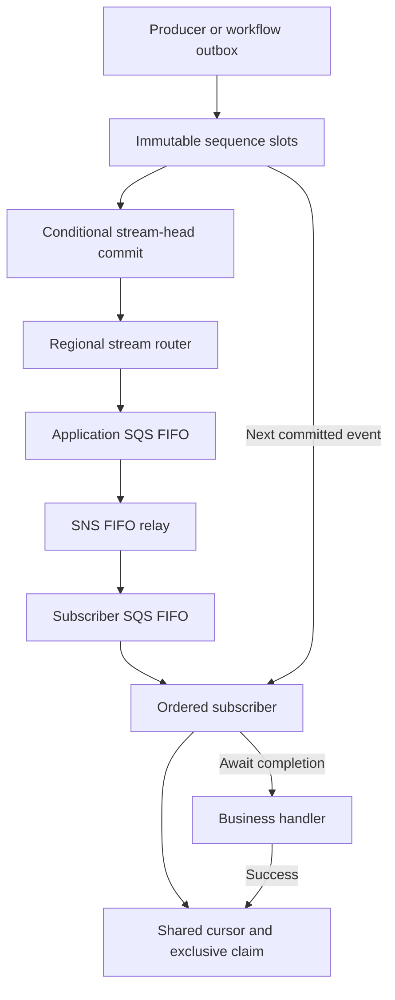

# Ordered application events across Regions

An ordered subscriber observes committed events in ascending sequence for each stream. The task example defines `requested → approved → started → completed` as positions 1 through 4. Every regional deployment of a logical subscriber shares the same `subscriberId`, MRSC table and durable cursor. Different subscribers and different streams progress independently.

This guarantee applies to callbacks invoked through `createDynamoOrderedSubscriber`. Raw SNS/SQS consumers do not acquire the shared cursor and cannot claim cross-Region business ordering. A handler must await its complete operation before returning; detached work and the recipient-visible timing of an external provider are outside the guarantee. Delivery notifications and retries remain at least once.



## Publish a defined lifecycle

```ts
import { createDynamoApplicationEventPublisher } from '@ataylorme/tanstack-workflow-aws/events'
const publisher = createDynamoApplicationEventPublisher({
  tableName: process.env.TABLE_NAME!,
  orderedEventTypes: ['task.requested', 'task.approved', 'task.started', 'task.completed'],
})
await publisher.publish({
  type: 'task.requested',
  ordering: { streamId: 'tenant-123:task-456:attempt-1', sequence: 1 },
  data: { taskId: 'task-456' },
})
```

Use one unique stream ID per business lifecycle, including tenant scope. Event sequences start at 1. The publisher accepts the next contiguous position or an identical retry of an existing position. A gap, conflicting payload/ID, or wrong event type raises `EventSequenceError`. The example's positions 2, 3 and 4 must contain approved, started and completed respectively. Retrying a position without a timestamp returns its original timestamp. An omitted ID is deterministic from stream ID and sequence.

`orderedEventTypes` is a positional definition, established on the first publication and enforced from durable storage by every subsequent producer. Supply it when initializing streams. A generic stream can omit this definition and use any types with contiguous sequences. The envelope's `version` describes the event schema; `ordering.sequence` describes business order. They are independent.

The publisher stages an immutable slot at `ORDER#<stream hash>/EVENT#<sequence>`, then advances `META` using a conditional version write. Only head commits produce notifications. A staged event cannot be read by a subscriber until committed. A crash between staging and head advancement is repaired by retrying the same publication; competing content cannot take that position. There is no separate counter reservation that can silently skip a sequence.

Business mutations and publication still require a durable application outbox when they live in different stores. In workflows, supply `ordering` to `publishWorkflowEvent`; the committed intent preserves the sequence and payload, and the outbox uses the same ordered publisher path. Publish predecessors before successors. A workflow holding an unpublished predecessor must not wait for a later event that cannot commit until that predecessor does.

## Subscribe

```ts
import { createDynamoOrderedSubscriber } from '@ataylorme/tanstack-workflow-aws/ordered-events'
const subscriber = createDynamoOrderedSubscriber({
  tableName: process.env.TABLE_NAME!,
  subscriberId: 'task-notifications', // Same value in both Regions.
  async handler(event, delivery) {
    await notificationService.apply(event, { idempotencyKey: delivery.idempotencyKey })
  },
})
export const handler = subscriber.handler
```

The queue body is a notification that a stream has progressed. The subscriber strongly reads the retained source log and processes from its durable cursor through that notification's sequence. Receiving sequence 4 first therefore invokes 1, 2, 3 and 4. Receiving 1 afterward does nothing. The source log, not an untrusted queue payload, supplies each handler's event.

Before invoking a handler, the subscriber conditionally acquires a durable exclusive claim for exactly its next sequence. It acknowledges that sequence only after the handler resolves. Both regional consumers share this claim, so another invocation cannot process the same or a later event concurrently. Duplicate delivery after acknowledgement does not repeat the handler. A different `subscriberId` represents a separate logical consumer with its own cursor starting at 1.

The default invocation limit is ten events (configurable 1–100), with a remaining-time guard before each claim. A batch-limit or time-budget retry resumes from the acknowledged cursor. FIFO batch responses fail the current and remaining messages after an error. No later message is acknowledged merely because an earlier one failed or entered a DLQ.

## Uncertain effects stop the stream

**Claims do not expire automatically.** A timeout, handler exception or failed cursor acknowledgement leaves the claim in place. A second Region cannot infer from elapsed time whether the first invocation or its external request is still executing. Automatically stealing that claim could allow an earlier effect to complete after a later one. The design preserves ordering by stopping that subscriber's stream until the ambiguity is resolved. Other streams/subscribers remain independent; queue capacity and alarms still need operational management.

Use `subscriber.inspect(streamId)` to obtain the blocked claim ID and sequence. Before resolution, stop/fence the original execution and settle any outstanding external request. Then:

```ts
await subscriber.resolve({
  streamId,
  claimId, // Must still match the current claim.
  outcome: 'acknowledge', // Only after verifying the original effect completed.
})
// Or use outcome: 'retry' only when safe to perform that event again.
```

Resolution is an operator API, not a public HTTP endpoint or a timed retry job. `acknowledge` advances exactly the claimed sequence; `retry` clears the claim without advancing. Both use conditional writes and retain a resolution audit field. Use the destination's stable `delivery.idempotencyKey` to reconcile ambiguous results. Never acknowledge an unperformed effect merely to unblock a later event. Redrive/replay the notification after resolution. Redriving alone cannot bypass an unresolved claim.

There is no exactly-once guarantee for arbitrary external systems. If automatic crash recovery is required, the destination must provide a transactional/idempotent, sequence-fenced operation that can establish whether the effect committed. Implement and verify that destination-specific recovery before automating resolution.

## Deploy and recover notifications

Deploy `workers.yaml` in both Regions. It provides application SQS FIFO, its FIFO DLQ, SNS FIFO and the relay. Workflow wakeup queues remain standard. Group IDs derive from stream ID; deduplication IDs derive from stream ID and sequence. Ordered delivery correctness comes from the retained log and shared subscriber cursor, so it does not depend on FIFO's finite deduplication window or on two regional queues sharing an order.

Bundle `examples/ordered-subscriber.ts` as `ordered-subscriber.js` with the other Lambda handlers. Replace its illustrative logging handler with the awaited business operation. Deploy `cloudformation/ordered-subscriber.yaml` in each Region with:

| Parameter | Value |
| --- | --- |
| `TableName` | Shared MRSC table name |
| `SubscriberId` | Same logical subscriber ID in both Regions |
| `TopicArn` | Local workers stack's `ApplicationTopicArn` |
| `CodeBucket`, `CodeKey` | Local artifact bucket and immutable bundle key |

The subscriber stack creates a FIFO subscription queue/DLQ, raw-message SNS subscription, private Lambda, scoped IAM, retained logs, blocked-delivery metric/alarm and queue alarms. Its SNS filter selects ordered notifications. Do not filter out intermediate event types; route or ignore irrelevant types inside the ordered handler so its cursor still advances through every position. Connect alarm notification actions. Observe `ordered_delivery_blocked`, SNS notification failures, queue age and DLQs.

For a missing notification or stream-retention gap, read a committed event with `createDynamoOrderedEventPublisher({ tableName }).read(streamId, sequence)` and send it using `/aws`'s `createApplicationQueuePublisher` to the affected subscriber queue, or to the regional application queue for fanout. Replaying the latest committed event lets lagging subscribers catch up from their own cursors. FIFO can suppress a replay within its deduplication window; redrive the original messages or replay after that window. No table-wide polling is required. Workflow metadata reconciliation intentionally excludes ordered logs and subscriber cursors.

## Retention and bounds

Ordered logs and subscriber cursors are retained without automatic expiry. They must not be removed by the seven-day cleanup of unordered application events. Expiring a cursor would permit duplicate effects; expiring source events could strand a lagging subscriber. Store payload references for large data.

Each ordered stream has a persisted `maxEvents` bound (default 10,000; configurable up to 100,000 through `maxOrderedEvents` on the general publisher or `maxEvents` on the ordered publisher). Each event remains limited to 240 KiB. Use finite business lifecycles and unique IDs; reaching the bound rejects further publication. Reusing or deleting a stream ID/cursor is not a supported replay strategy. Archival/deletion requires an application-owned, coordinated policy covering all subscribers, outstanding effects and replay windows.
