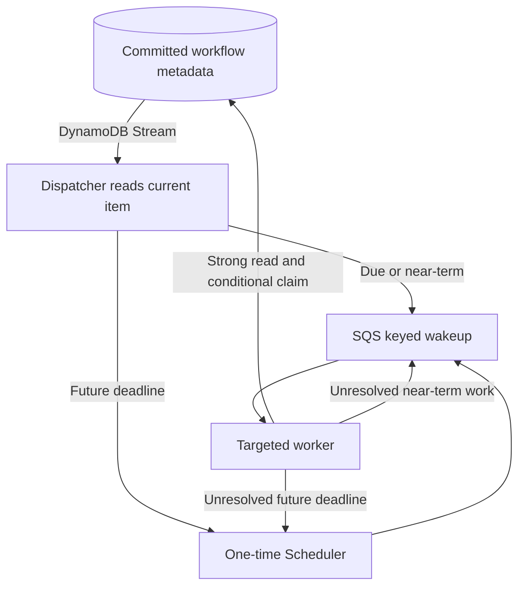
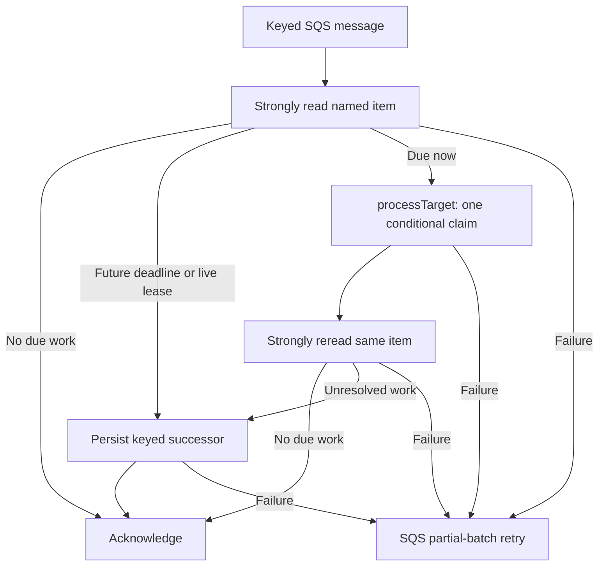

# Demand-driven workflow wakeups

The DynamoDB store persists work; it does **not** provision a scheduler or background workers. The optional examples replace permanent minute-based sweeps with:



Deploy the independent path in both application Regions. Application-event delivery remains a separate stream consumer/bridge. If a domain event should start a workflow, its consumer calls the runtime; the resulting workflow metadata—not the domain event itself—drives deadline scheduling.

## Semantics and limits

- The dispatcher filters workflow due categories `RUNNING`, `TIMER_RUN`, `TIMER`, and `SCHEDULE`, then strongly reads current state. History records and application events are not workflow wakeups.
- Effective deadlines include execution and timer-claim leases. Overdue/near-term work uses delayed SQS messages; future deadlines use deterministic one-time schedules with flexible windows off and automatic deletion. Obsolete messages are harmless after authoritative state checks.
- Scheduler has [60-second precision](https://docs.aws.amazon.com/scheduler/latest/UserGuide/schedule-types.html), not subsecond guarantees. Near-term delivery avoids creating an already-past schedule; creation crossing the deadline also requires an immediate durable fallback.
- The targeted worker retains runtime lease ownership/fencing, bounded execution, partial-batch retries, and durable continuations before acknowledging unresolved work. It calls `runtime.processTarget`, which directly claims one base-table item; normal keyed delivery never queries `DueIndex` or scans for other due work. A failed claim or empty result is not proof of completion: the worker rereads the named item.
- Independent regional delivery intentionally produces duplicates. MRSC conditional writes coordinate claims; external effects still need idempotency keys. This design does not provide exactly-once external delivery.
- Completed runs and indefinite signal/approval waits need no recurring wakeups. New durable transitions resume processing. The worker processes a persisted schedule bucket; it does not automatically materialize future cron/interval ticks. Applications must continue supplying schedule definitions/ticks through the existing materialization or `upsertSchedule` API. Intentional recurring application work is distinct from idle sweep polling.
- The default SQS mapping has no maximum-concurrency cap, allowing [Lambda’s low-traffic polling optimization](https://docs.aws.amazon.com/lambda/latest/dg/services-sqs-scaling.html). Empty queues still incur polling requests. The explicit empty `ScalingConfig` clears existing caps; adding a cap disables that optimization. Duplicate deliveries can still cause redundant reads of the named item, but do not trigger shared due-work queries. Validate concurrent claims and regional recovery for your workload before changing scaling.
- Removing periodic polling eliminates those idle invocations and queries, **not all AWS charges**. Provisioned resources, storage, retained logs, and actual workflow/event activity can still cost money.

## Targeted runtime and claims

The transport remains DynamoDB Streams, SQS and one-time EventBridge Scheduler. The version-1 `due` envelope still carries `{ key, dueKind, dueAt }`; no table migration or queue replacement is required. `dueKind` and `dueAt` in a message are hints. The worker rereads the item and uses its **current** category and effective deadline, so a delayed run-recovery message can safely become a timer wakeup for the same run.

| Current due category | `processTarget` target | Direct store claim |
| --- | --- | --- |
| `RUNNING` | `{ kind: 'run', runId }` | `claimStaleRun` |
| `TIMER_RUN` | `{ kind: 'timer', runId }` | `claimTimer` on the persisted run wait |
| `TIMER` | `{ kind: 'timer', runId, signalId }` | `claimTimer` on the standalone timer row |
| `SCHEDULE` | `{ kind: 'schedule', scheduleId }` | `claimScheduleBucket` |

The example decodes standalone timer IDs from the store's encoded key format. It never splits run or schedule IDs on embedded delimiters. All direct claims strongly read the base item, check eligibility and leases, then use the same version-conditional claim logic as legacy sweeps. Recovery of accepted signals/approvals, timer deduplication, pending schedule buckets, and `skip`/`allow` overlap policies remain shared behavior.

```ts
await store.withLeaseOwner(owner, () => runtime.processTarget({
  target: { kind: 'run', runId },
  leaseOwner: owner,
  maxDurationMs: 5_000,
  includeEvents: false,
}))
```

`processTarget` executes at most one claimed run, timer, or schedule bucket per call. It returns `recovered`, `timers`, `scheduled`, `summary`, and `deadlineReached`; it makes no claim about unrelated backlog and has no `remainingMayExist` flag. It uses the matching packaged runtime's replay, execution-budget, lease, and recovery-backoff behavior. Stores without the selected optional direct-claim method fail explicitly; there is no fallback to broad discovery. The DynamoDB store implements all three methods; the vendored in-memory store does not implement this host extension.

This runtime method does not provision or persist transport wakeups. The SQS example in `examples/sweeper.ts` supplies that responsibility: before acknowledging a keyed message it rereads the same item, and if unresolved, persists a successor at the later of the effective deadline and one second from now. Short delays use SQS; longer deadlines use Scheduler. Propagated read, execution, or continuation-delivery errors become SQS partial-batch failures. Recoverable driver failures that successfully persist backoff return diagnostics and follow the same keyed continuation path. Completed/deleted items and indefinite waits produce no successor. Independent stream wakeups may duplicate this continuation, and conditional claims make those duplicates safe.



## Upgrade an existing demand-driven deployment

Keep the existing queues, schedules, stream mappings, IAM roles, table and `DueIndex`. Deploy the updated runtime/store and `sweeper.js` together under an immutable artifact key in each Region. The dispatcher and message format remain compatible, so pending version-1 keyed messages and one-time schedules automatically use targeted processing after worker replacement.

The filename `sweeper.ts`, Lambda handler `sweeper.handler`, stack outputs, and CloudFormation logical IDs are retained for deployment compatibility. Explicit `{ kind: 'sweep' }` invocations and old version-1 `drain` queue messages still invoke bounded legacy sweeps; only an old drain may enqueue another drain. New keyed messages never emit drains or call `runtime.sweep`. Keep `DueIndex` and discovery permissions while these compatibility paths exist. A rollback to the previous demand-driven worker can consume the same keyed messages and resumes its old sweeping behavior.

After pending legacy drains finish, verify normal keyed processing produces no `Query`/`Scan` calls or broad claims. Do not purge pending messages to achieve this. Test duplicate delivery, run-to-timer transitions, and continuation persistence in both Regions. If the deployment still uses a periodic rule, follow the polling migration below before removing it.

## Build and deploy

Use your own AWS credentials, names and buckets. Never commit resolved ARNs, account identifiers, endpoints, deployment evidence or credentials. The commands below assume a fresh MRSC table deployed once using `global-table.yaml`, with both replicas ACTIVE and streams enabled. Existing stacks must follow the migration section instead.

From this checkout:

```sh
npm ci
npm run build
mkdir -p build/lambda
for entry in handler sweeper dispatcher; do
  npx esbuild "examples/$entry.ts" --bundle --platform=node --target=node22 \
    --format=cjs --outfile="build/lambda/$entry.js"
done
(cd build/lambda && zip ../workflow.zip handler.js sweeper.js dispatcher.js)
```

The examples share `examples/runtime.ts`; use the same workflow registry and compatible loaders as the application. Copying them into another application requires installing their AWS SDK dependencies, including `@aws-sdk/client-scheduler`; the library does not install the example infrastructure for you.

Set these local values, then run the regional block once in each application Region with its own artifact bucket. Use an immutable `CODE_KEY` for every new build; alternatively pass a new `CodeObjectVersion` when using a versioned bucket.

```sh
export AWS_PROFILE=YOUR_SANDBOX_PROFILE
export TABLE_NAME=YOUR_WORKFLOW_TABLE
export REGION=us-west-2 # Repeat with us-east-1 and its regional bucket.
export CODE_BUCKET=YOUR_REGIONAL_ARTIFACT_BUCKET
export CODE_KEY=workflow/YOUR_UNIQUE_BUILD_ID.zip
export WAKEUP_STACK=YOUR_REGIONAL_WAKEUP_STACK

STREAM_ARN=$(aws dynamodb describe-table --region "$REGION" \
  --table-name "$TABLE_NAME" --query 'Table.LatestStreamArn' --output text)
test -n "$STREAM_ARN" && test "$STREAM_ARN" != None || exit 1
aws s3 cp build/workflow.zip "s3://$CODE_BUCKET/$CODE_KEY" --region "$REGION"
aws cloudformation deploy --region "$REGION" --stack-name "$WAKEUP_STACK" \
  --template-file cloudformation/sweeper.yaml --capabilities CAPABILITY_IAM \
  --parameter-overrides "TableName=$TABLE_NAME" "StreamArn=$STREAM_ARN" \
    "CodeBucket=$CODE_BUCKET" "CodeKey=$CODE_KEY" LegacyScheduleMode=removed
```

Check that the ARN belongs to the intended table **and current Region**. Do not reuse the west stream ARN in the east stack. Review CloudFormation change sets before changing existing resources. For a standalone API, also deploy `regional.yaml` with the same table and ZIP, then `edge.yaml`, following the README. Existing applications need only the wakeup stacks and their existing web runtime integration.

## Migrate existing polling stacks

1. Inventory both regional stacks, current rule state, table streams, artifact keys/versions, and workflow registry versions. Save a rollback record privately outside tracked source. Do not replace the table or modify application-event bridge infrastructure.
2. For existing `sweeper.yaml` stacks, update with `LegacyScheduleMode=enabled` while adding the stream/Scheduler/SQS path. For old standalone `regional.yaml` stacks, explicitly preserve their integrated legacy resources with `LegacyScheduleMode=enabled` and deploy separate wakeup stacks. **Do not accept the new `removed` default during the additive phase.**
3. Wait for both regional stream mappings to become enabled and confirm dispatcher/worker permissions with a bounded test. An active stream does not replay arbitrary old table state.
4. Reconcile existing work using `examples/reconcile-wakeups.mjs` in **each Region**. It performs a paginated, strongly consistent base-table Scan (not `DueIndex`) and invokes the dispatcher in bounded key batches. The dispatcher strongly rereads each item and uses normal scheduling logic. Dry-run is the default; review it before `--execute`. Configure `EXPECTED_AWS_ACCOUNT_ID` only in your local environment, never tracked source:

   ```sh
   export EXPECTED_AWS_ACCOUNT_ID=YOUR_EXPECTED_ACCOUNT_ID
   export AWS_REGION="$REGION"
   export DISPATCHER_FUNCTION_NAME=$(aws cloudformation describe-stacks \
     --region "$REGION" --stack-name "$WAKEUP_STACK" \
     --query 'Stacks[0].Outputs[?OutputKey==`DispatcherFunctionName`].OutputValue | [0]' \
     --output text)
   node examples/reconcile-wakeups.mjs
   node examples/reconcile-wakeups.mjs --execute
   ```

   Require success for every item before cutover; retain private evidence in ignored `.deploy/`. Retry failures idempotently. Do not mutate/delete table rows or invoke a one-off sweep as a substitute for installing future wakeups. Concurrent writes are covered by the already-enabled streams and authoritative dispatcher reads.
5. Change the stack that owns each old rule to `LegacyScheduleMode=disabled`. Retain compatible legacy invocation support and resources during the observation period. Run the recovery, timer, concurrency, application-event, and idle checks in [the test guide](testing.md#demand-driven-wakeup-acceptance).
6. After passing checks in both Regions, set the owning stacks to `LegacyScheduleMode=removed`. Verify that no enabled recurring sweep rules remain. Fresh stacks should use `removed` from the start.

Rollback before removal by setting the owning stacks back to `enabled`; after removal, recreate the legacy resources using the compatible wakeup template with `LegacyScheduleMode=enabled`. Use the saved artifact configuration for code rollback; do not restore a pre-wakeup template that would delete queues. Keep the table and pending messages intact. Disable only a malfunctioning new processing path, retain its failure records, then reconcile before retrying cutover. Never restore a worker version that cannot interpret in-flight workflow state.

## Operations and recovery

Monitor dispatcher errors, stream iterator age, Scheduler target delivery failures, queue oldest-message age, processing failures, and DLQ backlog. Alarm delivery needs an operator-owned notification destination; the mere presence of an alarm is not paging. A successful Scheduler delivery to SQS means accepted transport, not a completed workflow.

SQS redelivery and partial-batch retries cover transient execution failures. Fix the underlying issue (permissions, throttling, missing workflow loaders, or broken code) before redriving DLQs. Preserve original wakeup bodies and use bounded redrive to the intended regional source queue; authoritative reads make obsolete wakeups no-ops. Check Scheduler delivery failures separately from worker processing failures. Review stream failure records and replay affected keys through the dispatcher after repair.

[DynamoDB Streams retains records for 24 hours](https://docs.aws.amazon.com/amazondynamodb/latest/developerguide/HowItWorks.CoreComponents.html). An outage longer than retention, exhausted retries, or lost failure records requires the base-table reconciliation described above; there is intentionally no permanent periodic scan to repair it automatically. One-time schedules also require the target queue, roles, and compatible workers to remain available until pending work drains.

Regional independence depends on MRSC quorum and available consumers, not on the ingress router. Test failure in each direction and restore disabled mappings in `finally`. Neither this example nor its documentation establishes production readiness or zero-cost infrastructure.
