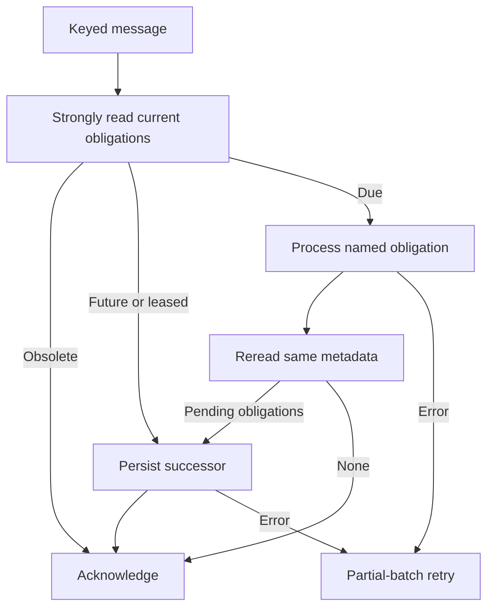

# Workflow routing, workers and deployment

## Supported adapters

`createWorkflowStreamRouter` and `createWorkflowWorker` are supported exports from `/wakeups`. They accept injected transport/runtime/store dependencies. `createAwsWorkflowTransport` and `createApplicationQueuePublisher` from `/aws` supply regional SQS/Scheduler implementations; SDK clients can be injected for credentials, request budgets, or tests.

The thin `examples/router.ts`, `examples/worker.ts`, and `examples/application-consumer.ts` handlers demonstrate assembly. `examples/handler.ts` is the optional HTTP entry point. Infrastructure and credentials remain application responsibilities.

## Single-reader routing

Configure one DynamoDB stream mapping per replica, with `NEW_AND_OLD_IMAGES`, `TRIM_HORIZON`, and `ReportBatchItemFailures`. The router sends immutable application INSERT envelopes to ApplicationQueue and schedules keyed workflow/lifecycle obligations. It does not call business handlers or external webhooks.

Within a stream batch, repeated keys are read once. Old/new image comparison ignores changes that do not affect work eligibility, pending effects or cleanup. Lease extensions with unchanged ownership do not generate another wakeup: the already-durable expiration wakeup rereads the lease and follows its current deadline. First claims, lease-owner changes, run transitions, new effect obligations and new cleanup deadlines remain observable.

The router acknowledges only after durable handoff. If a later application record fails while earlier keys await dispatch, the batch checkpoint returns to the earliest pending sequence. Replay may duplicate successful sends, so application consumers must be idempotent. Metrics report input records, ignored changes, unique dispatched keys and application event sends.

## Targeted processing

| Obligation | Action |
| --- | --- |
| `RUNNING` | Strong read and conditional claim of the named queued/expired run |
| `TIMER_RUN` | Claim the timer wait persisted on the named run |
| `TIMER` | Claim or remove a named standalone timer |
| `SCHEDULE` | Claim one bucket and atomically advance its future deadline |
| `OUTBOX` | Publish committed intents or create deterministic successor runs |
| `CLEANUP` | Bounded partition cleanup, tombstone compaction or tombstone expiry |

The version-1 envelope carries `{ version, kind: 'due', key, dueKind, dueAt }`. Message timestamps and workflow categories are hints: the worker reads authoritative current state. The storage contract is `schemaVersion: 1`; unknown versions fail explicitly. Build and deploy one package revision with one workflow registry throughout the application.



After processing, every unresolved obligation on that item gets a durable successor before acknowledgement. The continuation floor is one second; this is not a delivery-time guarantee. The AWS adapter uses SQS for deadlines within fifteen seconds and deterministic one-time Scheduler entries otherwise. It disables flexible windows, automatically deletes completed schedules, verifies conflicting schedule definitions, and enqueues a fallback if creation completes after the requested time. Scheduler precision is sixty seconds.

The runtime API `processTarget` uses direct store claims and performs no cross-run discovery. Its result contains `recovered`, `timers`, `scheduled`, `summary` and `deadlineReached`. It does not install transport obligations itself. `createWorkflowWorker` supplies continuation persistence, owner binding, remaining-time checks, partial failures and deferred-work diagnostics. The generic in-memory store does not implement direct claim methods.

Both regions independently route deadlines; duplicates are expected and MRSC conditional claims arbitrate ownership. External side effects still need idempotency keys. Neither SQS nor Streams is a zero-polling AWS service; they avoid idle application Lambda execution, not every idle service request charge.

## Build and deploy

Deploy the MRSC table once using `cloudformation/global-table.yaml` from `us-west-2`. Wait for the east/west replicas and Ohio witness before writing data. See [MRSC provisioning](mrsc-deployment.md).

```sh
npm ci
npm run build
mkdir -p build/lambda
npx --no-install esbuild examples/handler.ts examples/router.ts examples/worker.ts examples/application-consumer.ts \
  --bundle --platform=node --target=node22 --format=cjs --outdir=build/lambda
(cd build/lambda && zip ../workflow.zip handler.js router.js worker.js application-consumer.js)
```

Run this regional block once in each application Region. Set deployment-specific values locally; do not commit account IDs, credentials or private deployment evidence. Use an immutable code key or S3 object version.

```sh
export AWS_PROFILE=YOUR_SANDBOX_PROFILE
export TABLE_NAME=YOUR_WORKFLOW_TABLE
export REGION=us-west-2
export CODE_BUCKET=YOUR_REGIONAL_BUCKET
export CODE_KEY=workflow/YOUR_BUILD_ID.zip
export WORKER_STACK=YOUR_REGIONAL_WORKER_STACK
STREAM_ARN=$(aws dynamodb describe-table --region "$REGION" --table-name "$TABLE_NAME" \
  --query 'Table.LatestStreamArn' --output text)
aws s3 cp build/workflow.zip "s3://$CODE_BUCKET/$CODE_KEY" --region "$REGION"
aws cloudformation deploy --region "$REGION" --stack-name "$WORKER_STACK" \
  --template-file cloudformation/workers.yaml --capabilities CAPABILITY_IAM \
  --parameter-overrides "TableName=$TABLE_NAME" "StreamArn=$STREAM_ARN" \
    "CodeBucket=$CODE_BUCKET" "CodeKey=$CODE_KEY"
```

This stack installs exactly one stream mapping, a workflow queue/worker, an independent application queue/consumer, a regional SNS topic, one-time schedule infrastructure, DLQs and failure alarms. Subscribe downstream destinations to the regional topics or supply a different application queue handler. A logical consumer subscribed in both regions must deduplicate by event ID. Do not attach additional stream mappings to the table for domain handlers.

For the standalone HTTP example, deploy `regional.yaml` in both regions with the same table and code artifact, then deploy `edge.yaml` in `us-east-1` using the two `ApiDomain` outputs. The example needs authentication/access controls before public use. An existing Start application only needs the workers and its own ingress.

## Operations and recovery

Monitor `workflow_router_failed`, `workflow_wakeup_failed`, `workflow_deferred`, application delivery failures, iterator age, queue age, DLQs and failure-archive delivery. Connect alarm actions to your operator-owned notification destination. Logs intentionally omit application payloads. A successfully accepted queue message does not establish business-effect completion.

After repairing a delivery failure, redrive the appropriate queue or replay archived stream records. Preserve stable event IDs and original wakeup keys. For a stream-retention gap, invoke the router's bounded reconciliation entry point using `examples/reconcile-wakeups.mjs`. Its default is an offline plan; `--execute` requires `AWS_PROFILE`, `AWS_REGION`, `EXPECTED_AWS_ACCOUNT_ID`, `TABLE_NAME` and `ROUTER_FUNCTION_NAME`. It scans metadata explicitly for operator recovery, not periodically during normal execution. Run it independently in both regions. Application-event replay uses archived envelopes or retained event rows and the application queue publisher; metadata reconciliation only restores workflow, outbox and cleanup obligations.

Respect the configured retention/deduplication window when redriving old events or restoring backups. DynamoDB Streams retains records for 24 hours; failure records and reconciliation are required after longer interruptions. Keep source data and backup retention consistent with your recovery objectives.
